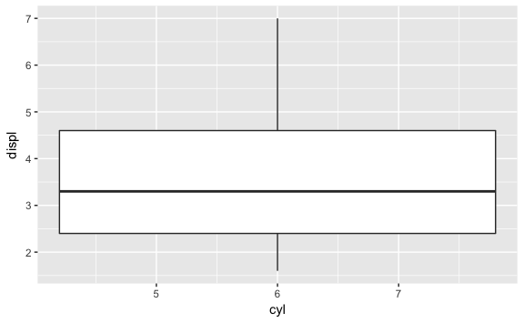

<!-- Generated automatically from data-summaries.yml. Do not edit by hand -->

# Grouped summaries

Summary functions take a vector of data and return a single number. Summary
geoms divide the data into pieces, apply some summary and visualise the
results. Summaries are useful when you have a lot of data (and plotting leads
to overplotting), or when the data is noisy (and you need to make small but
consistent patterns more clear). Here we apply these tools to small (in-memory)
data, but they're still useful when you have big (out-of-memory) data. That's
because a powerful strategy for working with big data is to make it small with
some combination of subsetting, summarising, or sampling.

## Readings

  * [Useful summary functions](http://r4ds.had.co.nz/transform.html#summarise-funs) [r4ds-5.6.4].
    Familiarise yourself with the summary functions that you can use in
    conjunction with `summarise()`

  * [Toolbox](http://link.springer.com.ezproxy.stanford.edu/chapter/10.1007/978-3-319-24277-4_3) [ggplot2-3].
    Read only section 3.5: compound geoms are conceptually the same as summary
    functions: they divide the data into groups and display a visual summary.


## Exercises
[Download `.Rmd`](data-summaries-exercises.Rmd)


1.  What's gone wrong with this plot? Why is there only one boxplot?

    ``` r
    ggplot(data = mpg) +
      geom_boxplot(mapping = aes(x = cyl, y = displ))
    ```

        ## Warning: Continuous x aesthetic -- did you forget aes(group=...)?

     .

