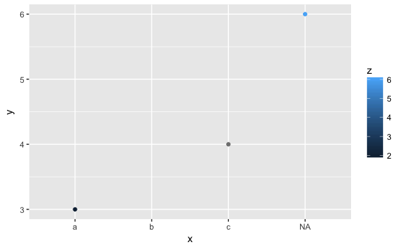

<!-- Generated automatically from missing-values.yml. Do not edit by hand -->

# Missing values

R uses `NA` to present unknown, but potentially measurable variables. In this
unit, you'll learn The pattern of missingness in a dataset is often
informative, so you should never silently ignore missing values.

## Readings

  * [Missing values](http://r4ds.had.co.nz/transform.html#missing-values) [r4ds-5.2.3].
    (transformation)

  * [Missing values](http://r4ds.had.co.nz/transform.html#missing-values-1) [r4ds-5.6.2].
    (summary)

  * [Missing values](http://r4ds.had.co.nz/exploratory-data-analysis.html#missing-values-2) [r4ds-7.4].
    (visualisation)

  * [Missing values](http://r4ds.had.co.nz/tidy-data.html#missing-values-3) [r4ds-12.5].
    (explicit vs implict). We haven't covered the vocabulary of "tidy data"
    yet, but be aware that different ways of organisation the same data may
    make explicit missing values that were previously implicit in the data.


## Exercises
[Download `missing-values-exercises.Rmd`](missing-values-exercises.Rmd)


1.  If `x` is a numeric vector containing some missing values, what does `sum(x == NA)` return. Why? What does `mean(is.na(x))` return? Why?

2.  What happens to flights with missing departure delays in the following filter statement?

    ``` r
    library(nycflights13)

    flights %>% 
      filter(dep_delay > 120)
    ```

3.  Compare and contrast the ways that missing values appear in the following plot. Why does missingness in `x`, `y`, and `z` display differently?

    ``` r
    df <- tribble(
      ~ x, ~ y, ~ z,
      "a",   3,   2,
      "b",  NA,   5,
      "c",   4,  NA,
      NA,    6,   6
    )
    ggplot(df, aes(x, y)) +
      geom_point(aes(colour = z))
    ```

        ## Warning: Removed 1 rows containing missing values (geom_point).

    

