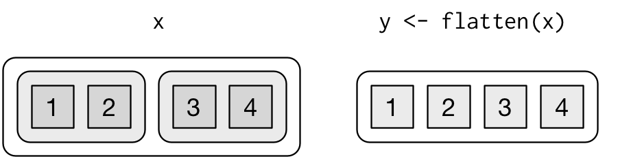

<!-- Generated automatically from rectangling.yml. Do not edit by hand -->

# Data rectangling <small class='wrangle'>[wrangle]</small>
<small>(Builds on: [List columns](list-cols.md))</small>


Data rectangling is the process of turning non-rectangular data into tidy tibbles. The term was [coined by](https://speakerdeck.com/jennybc/data-rectangling) [Jenny Bryan](https://www.stat.ubc.ca/~jenny/). Here we're going to focus on deeply nested lists as generated by JSON, a very common data type for web APIs.

To work with JSON we need the jsonlite package, which I recommend loading before the tidyverse. (Both purrr and jsonlite provide a flatten function; if you load jsonlite second, you'll get that function instead of the one from purrr.)

``` r
library(jsonlite)
library(tidyverse)
library(repurrrsive)
```

We're going to use some data from Jenny's repurrrsive package, which you'll need to install from GitHub. We'll also use the GitHub version of purrr which fixes some bugs that will make your life easier.

``` r
# install.packages("devtools")
devtools::install_github("jennybc/repurrrsive")
devtools::install_github("tidyverse/purrr")
```

JSON
----

JSON is a popular data exchange format that made up of three simple components:

-   **Values**, like numbers, `true`, `false`, and strings inside double quotes.

    ``` json
    true
    1.345
    "this is a string"
    ```

-   **Arrays**, sequences of values surrounded in square brackets. JSON arrays are like R's lists: you can have anything inside an array including other arrays.

    ``` json
    [1, 2, 3, 10, 120]
    ["this", "is", "a", "string"]
    ["can arrays mix types?", true, 100]
    ```

-   **Objects**, name-value pairs separated by colons. Objects are like named lists.

    ``` json
    {
      "key": "value",
      "name": "Hadley",
      "company": "RStudio"
    }
    ```

Arrays and objects can be nested arbitrarily: it's common to have arrays of objects, and objects with array values. You can load a json file into R with `jsonlite::read_json()`. Both arrays and objects are turned into R lists: objects become named lists, and arrays become unnamed lists.

An API of Ice and Fire
----------------------

Let's start with a fairly simple example: information about Game of Throne characters from the [API of Ice and Fire](https://anapioficeandfire.com) stored in `repurrrsive::got_chars`. The goal is to create a tibble with one row for each character.

### Inspect

The first challenge is just figuring out what this data looks like. Hopefully your instinct is to try `str()`. This is a great instinct, but it's not very helpful here because `str()` will prints pages and pages of output. Another option, if you're willing to live (a little) dangerously, is to use a [daily build](https://dailies.rstudio.com) of RStudio which has a good interactive explorer that you can activate with:

``` r
View(got_chars)
```

Otherwise, you can use a powerful and general technique: understand the list by peeling it apart one layer at a time. To do that you need to first figure out if you have an *array* (an unnamed list, which you should subset with an integer), or an *object* (a named list, which you should subset with a string). You can figure that our using `names()`:

``` r
names(got_chars)
#> NULL
length(got_chars)
#> [1] 29

one <- got_chars[[1]]
str(one)
#> List of 18
#>  $ url        : chr "http://www.anapioficeandfire.com/api/characters/1022"
#>  $ id         : int 1022
#>  $ name       : chr "Theon Greyjoy"
#>  $ gender     : chr "Male"
#>  $ culture    : chr "Ironborn"
#>  $ born       : chr "In 278 AC or 279 AC, at Pyke"
#>  $ died       : chr ""
#>  $ alive      : logi TRUE
#>  $ titles     : chr [1:3] "Prince of Winterfell" "Captain of Sea Bitch" "Lord of the Iron Islands (by law of the green lands)"
#>  $ aliases    : chr [1:4] "Prince of Fools" "Theon Turncloak" "Reek" "Theon Kinslayer"
#>  $ father     : chr ""
#>  $ mother     : chr ""
#>  $ spouse     : chr ""
#>  $ allegiances: chr "House Greyjoy of Pyke"
#>  $ books      : chr [1:3] "A Game of Thrones" "A Storm of Swords" "A Feast for Crows"
#>  $ povBooks   : chr [1:2] "A Clash of Kings" "A Dance with Dragons"
#>  $ tvSeries   : chr [1:6] "Season 1" "Season 2" "Season 3" "Season 4" ...
#>  $ playedBy   : chr "Alfie Allen"
```

Here it we have an array of 29 objects, where each object is a person. Typically JSON files have consistent structure, so if the first element of the list is a person, it's likely all the other elements will be too.

### Rectangle

Imagine we want to collapse some of this information into a tibble with one row for each person. For the sake of this example, lets say we want the following variables:

-   The name of the character.
-   Their unique identifier.
-   If they're alive.
-   Their gender.
-   The books they appear in.

To extract each of these variables we need to use a map function. The first four are straightforward: you just need to identify the name of the component and its type.

``` r
got_chars %>% map_chr("name")
#>  [1] "Theon Greyjoy"      "Tyrion Lannister"   "Victarion Greyjoy" 
#>  [4] "Will"               "Areo Hotah"         "Chett"             
#>  [7] "Cressen"            "Arianne Martell"    "Daenerys Targaryen"
#> [10] "Davos Seaworth"     "Arya Stark"         "Arys Oakheart"     
#> [13] "Asha Greyjoy"       "Barristan Selmy"    "Varamyr"           
#> [16] "Brandon Stark"      "Brienne of Tarth"   "Catelyn Stark"     
#> [19] "Cersei Lannister"   "Eddard Stark"       "Jaime Lannister"   
#> [22] "Jon Connington"     "Jon Snow"           "Aeron Greyjoy"     
#> [25] "Kevan Lannister"    "Melisandre"         "Merrett Frey"      
#> [28] "Quentyn Martell"    "Sansa Stark"
got_chars %>% map_int("id")
#>  [1] 1022 1052 1074 1109 1166 1267 1295  130 1303 1319  148  149  150  168
#> [15] 2066  208  216  232  238  339  529  576  583   60  605  743  751  844
#> [29]  957
got_chars %>% map_lgl("alive")
#>  [1]  TRUE  TRUE  TRUE FALSE  TRUE FALSE FALSE  TRUE  TRUE  TRUE  TRUE
#> [12] FALSE  TRUE  TRUE FALSE  TRUE  TRUE FALSE  TRUE FALSE  TRUE  TRUE
#> [23]  TRUE  TRUE FALSE  TRUE FALSE FALSE  TRUE
got_chars %>% map_chr("gender")
#>  [1] "Male"   "Male"   "Male"   "Male"   "Male"   "Male"   "Male"  
#>  [8] "Female" "Female" "Male"   "Female" "Male"   "Female" "Male"  
#> [15] "Male"   "Male"   "Female" "Female" "Female" "Male"   "Male"  
#> [22] "Male"   "Male"   "Male"   "Male"   "Female" "Male"   "Male"  
#> [29] "Female"
```

The list of books is a little trickier:

``` r
got_chars %>% map_chr("books")
#> Error: Result 1 is not a length 1 atomic vector
```

This is because the `map_` functions want scalars: the contract for a map function is that it always returns a vector the same length as the input. So instead of returning an atomic vector, here we need a list, as produced by `map()`:

``` r
got_chars %>% map("books") %>% head(10) %>% str()
#> List of 10
#>  $ : chr [1:3] "A Game of Thrones" "A Storm of Swords" "A Feast for Crows"
#>  $ : chr [1:2] "A Feast for Crows" "The World of Ice and Fire"
#>  $ : chr [1:3] "A Game of Thrones" "A Clash of Kings" "A Storm of Swords"
#>  $ : chr "A Clash of Kings"
#>  $ : chr [1:3] "A Game of Thrones" "A Clash of Kings" "A Storm of Swords"
#>  $ : chr [1:2] "A Game of Thrones" "A Clash of Kings"
#>  $ : chr [1:2] "A Storm of Swords" "A Feast for Crows"
#>  $ : chr [1:4] "A Game of Thrones" "A Clash of Kings" "A Storm of Swords" "A Dance with Dragons"
#>  $ : chr "A Feast for Crows"
#>  $ : chr "A Feast for Crows"
```

Once we confirmed that we can extract each variable individually, we can combine them into a single tibble:

``` r
got_tibble <- tibble(
  name = got_chars %>% map_chr("name"),
  id = got_chars %>% map_int("id"),
  alive = got_chars %>% map_lgl("alive"),
  gender = got_chars %>% map_chr("gender"),
  books = got_chars %>% map("books")
)
got_tibble
#> # A tibble: 29 x 5
#>                  name    id alive gender     books
#>                 <chr> <int> <lgl>  <chr>    <list>
#>  1      Theon Greyjoy  1022  TRUE   Male <chr [3]>
#>  2   Tyrion Lannister  1052  TRUE   Male <chr [2]>
#>  3  Victarion Greyjoy  1074  TRUE   Male <chr [3]>
#>  4               Will  1109 FALSE   Male <chr [1]>
#>  5         Areo Hotah  1166  TRUE   Male <chr [3]>
#>  6              Chett  1267 FALSE   Male <chr [2]>
#>  7            Cressen  1295 FALSE   Male <chr [2]>
#>  8    Arianne Martell   130  TRUE Female <chr [4]>
#>  9 Daenerys Targaryen  1303  TRUE Female <chr [1]>
#> 10     Davos Seaworth  1319  TRUE   Male <chr [1]>
#> # ... with 19 more rows
```

Our rectangling is complete!

GitHub repos
------------

Now, let's tackle a slightly more challenging problem: some information about GitHub repository that's stored in `repurrrsive::gh_repos`.

### Inspect

The first challenge is always inspecting the data. We start by figuring out if we have an array or an object at the top level:

``` r
names(gh_repos)
#> NULL
length(gh_repos)
#> [1] 6
```

Here names is `NULL`, so we have an array and should subset by position:

``` r
one <- gh_repos[[1]]
```

It's worth trying `str()` again, but unfortunately this object is *still* too complicated. Let's index into it again:

``` r
names(one)
#> NULL
length(one)
#> [1] 30

# No names, so we can index by position
one_one <- one[[1]]
```

Let's try `str()` once more:

``` r
str(one_one)
#> List of 68
#>  $ id               : int 61160198
#>  $ name             : chr "after"
#>  $ full_name        : chr "gaborcsardi/after"
#>  $ owner            :List of 17
#>   ..$ login              : chr "gaborcsardi"
#>   ..$ id                 : int 660288
#>   ..$ avatar_url         : chr "https://avatars.githubusercontent.com/u/660288?v=3"
#>   ..$ gravatar_id        : chr ""
#>   ..$ url                : chr "https://api.github.com/users/gaborcsardi"
#>   ..$ html_url           : chr "https://github.com/gaborcsardi"
#>   ..$ followers_url      : chr "https://api.github.com/users/gaborcsardi/followers"
#>   ..$ following_url      : chr "https://api.github.com/users/gaborcsardi/following{/other_user}"
#>   ..$ gists_url          : chr "https://api.github.com/users/gaborcsardi/gists{/gist_id}"
#>   ..$ starred_url        : chr "https://api.github.com/users/gaborcsardi/starred{/owner}{/repo}"
#>   ..$ subscriptions_url  : chr "https://api.github.com/users/gaborcsardi/subscriptions"
#>   ..$ organizations_url  : chr "https://api.github.com/users/gaborcsardi/orgs"
#>   ..$ repos_url          : chr "https://api.github.com/users/gaborcsardi/repos"
#>   ..$ events_url         : chr "https://api.github.com/users/gaborcsardi/events{/privacy}"
#>   ..$ received_events_url: chr "https://api.github.com/users/gaborcsardi/received_events"
#>   ..$ type               : chr "User"
#>   ..$ site_admin         : logi FALSE
#>  $ private          : logi FALSE
#>  $ html_url         : chr "https://github.com/gaborcsardi/after"
#>  $ description      : chr "Run Code in the Background"
#>  $ fork             : logi FALSE
#>  $ url              : chr "https://api.github.com/repos/gaborcsardi/after"
#>  $ forks_url        : chr "https://api.github.com/repos/gaborcsardi/after/forks"
#>  $ keys_url         : chr "https://api.github.com/repos/gaborcsardi/after/keys{/key_id}"
#>  $ collaborators_url: chr "https://api.github.com/repos/gaborcsardi/after/collaborators{/collaborator}"
#>  $ teams_url        : chr "https://api.github.com/repos/gaborcsardi/after/teams"
#>  $ hooks_url        : chr "https://api.github.com/repos/gaborcsardi/after/hooks"
#>  $ issue_events_url : chr "https://api.github.com/repos/gaborcsardi/after/issues/events{/number}"
#>  $ events_url       : chr "https://api.github.com/repos/gaborcsardi/after/events"
#>  $ assignees_url    : chr "https://api.github.com/repos/gaborcsardi/after/assignees{/user}"
#>  $ branches_url     : chr "https://api.github.com/repos/gaborcsardi/after/branches{/branch}"
#>  $ tags_url         : chr "https://api.github.com/repos/gaborcsardi/after/tags"
#>  $ blobs_url        : chr "https://api.github.com/repos/gaborcsardi/after/git/blobs{/sha}"
#>  $ git_tags_url     : chr "https://api.github.com/repos/gaborcsardi/after/git/tags{/sha}"
#>  $ git_refs_url     : chr "https://api.github.com/repos/gaborcsardi/after/git/refs{/sha}"
#>  $ trees_url        : chr "https://api.github.com/repos/gaborcsardi/after/git/trees{/sha}"
#>  $ statuses_url     : chr "https://api.github.com/repos/gaborcsardi/after/statuses/{sha}"
#>  $ languages_url    : chr "https://api.github.com/repos/gaborcsardi/after/languages"
#>  $ stargazers_url   : chr "https://api.github.com/repos/gaborcsardi/after/stargazers"
#>  $ contributors_url : chr "https://api.github.com/repos/gaborcsardi/after/contributors"
#>  $ subscribers_url  : chr "https://api.github.com/repos/gaborcsardi/after/subscribers"
#>  $ subscription_url : chr "https://api.github.com/repos/gaborcsardi/after/subscription"
#>  $ commits_url      : chr "https://api.github.com/repos/gaborcsardi/after/commits{/sha}"
#>  $ git_commits_url  : chr "https://api.github.com/repos/gaborcsardi/after/git/commits{/sha}"
#>  $ comments_url     : chr "https://api.github.com/repos/gaborcsardi/after/comments{/number}"
#>  $ issue_comment_url: chr "https://api.github.com/repos/gaborcsardi/after/issues/comments{/number}"
#>  $ contents_url     : chr "https://api.github.com/repos/gaborcsardi/after/contents/{+path}"
#>  $ compare_url      : chr "https://api.github.com/repos/gaborcsardi/after/compare/{base}...{head}"
#>  $ merges_url       : chr "https://api.github.com/repos/gaborcsardi/after/merges"
#>  $ archive_url      : chr "https://api.github.com/repos/gaborcsardi/after/{archive_format}{/ref}"
#>  $ downloads_url    : chr "https://api.github.com/repos/gaborcsardi/after/downloads"
#>  $ issues_url       : chr "https://api.github.com/repos/gaborcsardi/after/issues{/number}"
#>  $ pulls_url        : chr "https://api.github.com/repos/gaborcsardi/after/pulls{/number}"
#>  $ milestones_url   : chr "https://api.github.com/repos/gaborcsardi/after/milestones{/number}"
#>  $ notifications_url: chr "https://api.github.com/repos/gaborcsardi/after/notifications{?since,all,participating}"
#>  $ labels_url       : chr "https://api.github.com/repos/gaborcsardi/after/labels{/name}"
#>  $ releases_url     : chr "https://api.github.com/repos/gaborcsardi/after/releases{/id}"
#>  $ deployments_url  : chr "https://api.github.com/repos/gaborcsardi/after/deployments"
#>  $ created_at       : chr "2016-06-14T22:33:49Z"
#>  $ updated_at       : chr "2016-07-21T17:42:35Z"
#>  $ pushed_at        : chr "2016-07-09T16:13:42Z"
#>  $ git_url          : chr "git://github.com/gaborcsardi/after.git"
#>  $ ssh_url          : chr "git@github.com:gaborcsardi/after.git"
#>  $ clone_url        : chr "https://github.com/gaborcsardi/after.git"
#>  $ svn_url          : chr "https://github.com/gaborcsardi/after"
#>  $ homepage         : NULL
#>  $ size             : int 15
#>  $ stargazers_count : int 5
#>  $ watchers_count   : int 5
#>  $ language         : chr "R"
#>  $ has_issues       : logi TRUE
#>  $ has_downloads    : logi TRUE
#>  $ has_wiki         : logi TRUE
#>  $ has_pages        : logi FALSE
#>  $ forks_count      : int 0
#>  $ mirror_url       : NULL
#>  $ open_issues_count: int 0
#>  $ forks            : int 0
#>  $ open_issues      : int 0
#>  $ watchers         : int 5
#>  $ default_branch   : chr "master"
```

The output is long, but informative! If you study this for a little bit, you should realise that we have a bunch of information about a single GitHub repository (`gaborcsard/after`).

Our hypothesis then is that we have an array of arrays of objects, where each object contains information about a GitHub repository. In other words, `gh_repos[[1]]` is a list of GitHub repos (which is also a list). And so is `gh_repos[[2]]`, `gh_repos[[3]]`, ..., all the way up to `gh_repos[[6]]`. We can check this hypothesis by spelunking around the list a little more (results hidden to save space).

``` r
str(gh_repos[[1]][[2]])
str(gh_repos[[2]][[2]])
str(gh_repos[[6]][[30]])
```

How many repos are there in total? We need to find the length of each sub-list, and sum them up:

``` r
gh_repos %>% map_int(length) %>% sum()
#> [1] 176
```

### Flatten

This nesting is annoying and doesn't contain any useful information. (You might wonder why it's there in the first place: here it's because each top-level list is for a single user, but it's common to see this sort of structure when retrieving multiple pages of data). The easiest thing is to get rid of it by using `flatten()`, which flattens a list of lists into a single list. There were 176 sublists before so now we get a list of length 176.

``` r
gh_flat <- gh_repos %>% flatten()
length(gh_flat)
#> [1] 176
```



### Rectangle

Imagine we want to collapse some of this information into a tibble. For the sake of this example, lets say we want:

-   the name of the repo
-   the number of open issues
-   if it has a wiki
-   the homepage
-   the owner's GitHub name

To extract each of these variables we need to use a map function. The first three are easy: you just need to identify the name of the component and its type.

``` r
first10 <- gh_flat %>% head(10)

first10 %>% map_chr("name")
#>  [1] "after"       "argufy"      "ask"         "baseimports" "citest"     
#>  [6] "clisymbols"  "cmaker"      "cmark"       "conditions"  "crayon"
first10 %>% map_int("open_issues_count")
#>  [1] 0 6 4 0 0 0 0 0 0 7
first10 %>% map_lgl("has_wiki")
#>  [1] TRUE TRUE TRUE TRUE TRUE TRUE TRUE TRUE TRUE TRUE
```

The homepage is a little trickier:

``` r
first10 %>% map_chr("homepage")
#> Error: Result 1 is not a length 1 atomic vector
```

Whenever you see this error, you've got two options to dig into it. Either switch to `map()` or find the specific value that's a problem. Here that's position 1.

``` r
first10[[1]]$"homepage"
#> NULL
first10 %>% map("homepage")
#> [[1]]
#> NULL
#> 
#> [[2]]
#> NULL
#> 
#> [[3]]
#> NULL
#> 
#> [[4]]
#> NULL
#> 
#> [[5]]
#> NULL
#> 
#> [[6]]
#> [1] ""
#> 
#> [[7]]
#> NULL
#> 
#> [[8]]
#> NULL
#> 
#> [[9]]
#> NULL
#> 
#> [[10]]
#> NULL
```

It looks like most of these are missing a homepage. JSON doesn't have missing values, so instead of an `NA`, we get a `NULL`. purrr map functions provide an easy way to turn these into something useful: you can supply a `.default` value. Here I'm going to use `""` since it looks like some repos get that value. Finding the right default value is often a matter of trial and error.

``` r
first10 %>% map_chr("homepage", .default = "")
#>  [1] "" "" "" "" "" "" "" "" "" ""
```

(None of the first 10 repos have homepages but later ones do)

Getting the owner's repo name is a little trickier because it doesn't live at the top-level; it lives one level down. Fortunately you can supply a character vector to the map functions:

``` r
first10 %>% map_chr(c("owner", "login"))
#>  [1] "gaborcsardi" "gaborcsardi" "gaborcsardi" "gaborcsardi" "gaborcsardi"
#>  [6] "gaborcsardi" "gaborcsardi" "gaborcsardi" "gaborcsardi" "gaborcsardi"
```

We can put all these bits together to make a tibble:

``` r
gh_tibble <- tibble(
  name =     gh_flat %>% map_chr("name"),
  issues =   gh_flat %>% map_int("open_issues_count"),
  wiki =     gh_flat %>% map_lgl("has_wiki"),
  homepage = gh_flat %>% map_chr("homepage", .default = ""),
  owner =    gh_flat %>% map_chr(c("owner", "login"))
)
gh_tibble
#> # A tibble: 176 x 5
#>           name issues  wiki homepage       owner
#>          <chr>  <int> <lgl>    <chr>       <chr>
#>  1       after      0  TRUE          gaborcsardi
#>  2      argufy      6  TRUE          gaborcsardi
#>  3         ask      4  TRUE          gaborcsardi
#>  4 baseimports      0  TRUE          gaborcsardi
#>  5      citest      0  TRUE          gaborcsardi
#>  6  clisymbols      0  TRUE          gaborcsardi
#>  7      cmaker      0  TRUE          gaborcsardi
#>  8       cmark      0  TRUE          gaborcsardi
#>  9  conditions      0  TRUE          gaborcsardi
#> 10      crayon      7  TRUE          gaborcsardi
#> # ... with 166 more rows
```

Our rectangling is complete!

