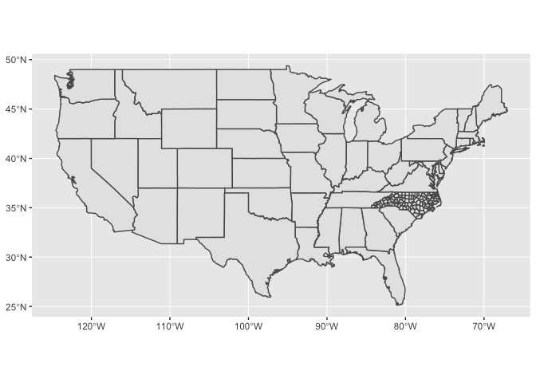

<!-- Generated automatically from spatial-vis.yml. Do not edit by hand -->

# Spatial visualisation <small class='explore'>[explore]</small>
<small>(Builds on: [Spatial basics](spatial-basics.md))</small>


Setup
-----

Since sf is so new, support for it in ggplot2 is also very new. That means you'll need to install the development version of ggplot2 from GitHub. That's easy to do using the devtools package:

``` r
# install.packages("devtools")
devtools::install_github("tidyverse/ggplot2")
```

Check that the install has succeeded by loading the tidyverse and then running `?geom_sf`. If you can't find the documentation for `geom_sf`, something has gone wrong. The first thing to try is restarting R so that you have a clean session. Installing ggplot2 is tricky if you already have it loaded!

Next we'll load the tidyverse, sf, and read in a couple of sample datasets.

``` r
library(tidyverse)
library(sf)
library(maps)

nc <- sf::st_read(system.file("shape/nc.shp", package = "sf"), quiet = TRUE)
states <- sf::st_as_sf(map("state", plot = FALSE, fill = TRUE))
```

`geom_sf()`
-----------

The easiest way to get started is to supply an sf object to `geom_sf()`:

``` r
ggplot() +
  geom_sf(data = nc)
```


Notice that ggplot2 takes care of setting the aspect ratio correctly.

You can supply other aesthetics: for polygons, `fill` is most useful:

``` r
ggplot() +
  geom_sf(aes(fill = AREA), data = nc, colour = "white")
```


When you include multiple layers, ggplot2 will take care of ensuring that they all have a common CRS so that it makes sense to overlay them.

``` r
ggplot() +
  geom_sf(data = states) + 
  geom_sf(data = nc)
```



You can combine `geom_sf()` with other geoms. In this case, `x` and `y` positions are assumed be in the same CRS as the sf object (typically these will be longitude and latitude).

``` r
ggplot() +
  geom_sf(data = nc) +
  annotate("point", x = -80, y = 35, colour = "red", size = 4)
```


`coord_sf()`
------------

You'll need to use `coord_sf()` for two reasons:

-   You want to zoom into a specified region of the plot by using `xlim` and `ylim`

    ``` r
    ggplot() +
      geom_sf(data = nc) +
      annotate("point", x = -80, y = 35, colour = "red", size = 4) + 
      coord_sf(xlim = c(-81, -79), ylim = c(34, 36))
    ```

    

-   You want to override to use a specific projection. If you don't specify the `crs` argument, it just uses the one provided in the first layer. The following example uses "USA\_Contiguous\_Albers\_Equal\_Area\_Conic". The easiest way to supply the CRS is as a EPSG ID. I found this ID (102003) with a little googling.

    ``` r
    ggplot() +
      geom_sf(data = states) +
      coord_sf(crs = st_crs(102003))
    ```

    

