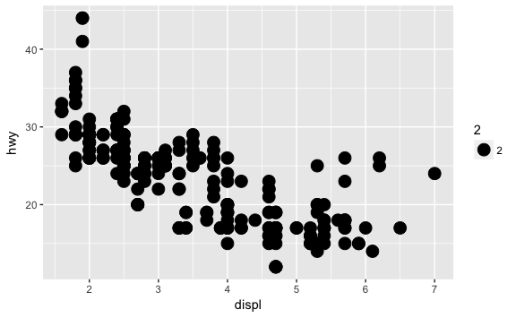

<!-- Generated automatically from vis-basics.yml. Do not edit by hand -->

# Data vis basics

Data visualisation is one of the most important tools of data science. It's
also a great place to start learning a programming language because you get an
immediate payoff that will help you keep motivated as you push through initial
frustrations

## Readings

These sections will give you the basics of ggplot2, allowing to create simple,
but informative, plots.

  * [Aesthetic mappings](http://r4ds.had.co.nz/data-visualisation.html#aesthetic-mappings) [r4ds-3.3]

  * [Common problems](http://r4ds.had.co.nz/data-visualisation.html#common-problems) [r4ds-3.4]

  * [Facets](http://r4ds.had.co.nz/data-visualisation.html#facets) [r4ds-3.5]

  * [Geometric objects](http://r4ds.had.co.nz/data-visualisation.html#geometric-objects) [r4ds-3.6]

Skim the following resources so you're aware of the most important ggplot2
geoms. Come back and read in detail when you actually need to use them.

  * [Toolbox](http://link.springer.com.ezproxy.stanford.edu/chapter/10.1007/978-3-319-24277-4_3) [ggplot2-3]

  * [Data Visualization Cheat Sheet](https://www.rstudio.com/wp-content/uploads/2016/11/ggplot2-cheatsheet-2.1.pdf) [cheatsheets-ggplot2-2.1]


## Exercises
[Download `vis-basics-exercises.Rmd`](vis-basics-exercises.Rmd)


1.  Map a continuous variable to the color, size, and shape aesthetics. Map a categorical variable to the color, size, and shape aesthetics. How do these aesthetics behave differently for categorical vs. continuous?

2.  What’s gone wrong with this plot? Why is there a weird legend?

    ``` r
    library(ggplot2)
    ggplot(data = mpg) +
      geom_point(mapping = aes(x = displ, y = hwy, size = 2))
    ```

    

3.  What do the dots (`.`) mean in the following ggplot2 commands?

    ``` r
    ggplot(data = mpg) + 
      geom_point(mapping = aes(x = displ, y = hwy)) +
      facet_grid(drv ~ .)

    ggplot(data = mpg) + 
      geom_point(mapping = aes(x = displ, y = hwy)) +
      facet_grid(. ~ cyl)
    ```


