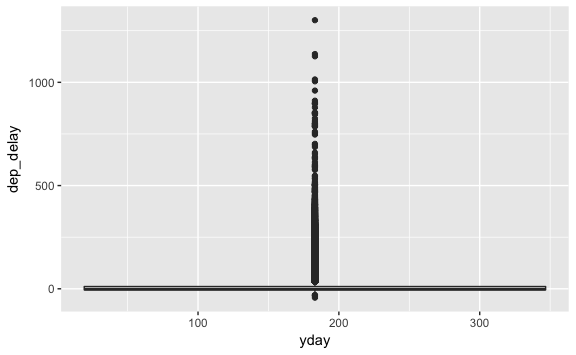

<!-- Generated automatically from vis-summaries.yml. Do not edit by hand -->

# Grouped summaries

Summary functions take a vector of data and return a single number; you use
them in conjunction with `dplyr::summarise()`. The ggplot2 equivalent are the
summary geoms, which the data into pieces, apply some summary and visualise the
results. Summaries are useful when you have a lot of data (and plotting leads
to overplotting), or when the data is noisy (and you need to make small but
consistent patterns more clear).

## Readings

  * [Toolbox](http://link.springer.com.ezproxy.stanford.edu/chapter/10.1007/978-3-319-24277-4_3) [ggplot2-3].
    Read only §3.5: summary geoms are a special case of compound geoms that do
    some aggregation before visualising the data.


## Exercises
[Download `.Rmd`](vis-summaries-exercises.Rmd)


1.  What's gone wrong with this plot? Why is there only one boxplot?

    ``` r
    library(nycflights13)

    flights <- mutate(flights, yday = lubridate::yday(time_hour))

    ggplot(flights, aes(yday, dep_delay)) +
      geom_boxplot()
    ```

    

    Explain the problem and give a solution that gives one boxplot for each day of the year.

2.  Use the following three techniques to visualise the distribution of delays by origin:

    -   Frequency polygon + colour
    -   Histogram + faceting
    -   Side-by-side boxplots

    What are the pros and cons of each approach?

3.  Another useful summary is the beeswarm plot (which you can create with [ggbeeswarm](https://github.com/eclarke/ggbeeswarm)). What makes them different to the other summary geoms?

