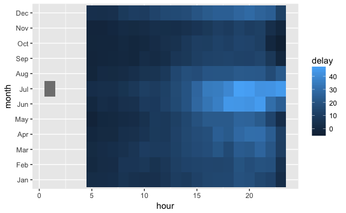

<!-- Generated automatically from vis-transformation.yml. Do not edit by hand -->

# Visual transformations

You've already learned about transformation functions that you use with
`dplyr::mutate()`. They take one (or more) vectors and return a transformed
vector of the same length. The ggplot2 equivalent of transformation functions
are the scales. They take variables (numeric, character, ...) and convert them
to visual properties (colour, shape, ...). Scales also control the axes and
legends which helper the reader understand the plot. Mastering this aspect of
scales is important when creating plots for others to understand. We'll come
back to this idea later.

## Readings

  * [Scales, axes and legends](http://link.springer.com.ezproxy.stanford.edu/chapter/10.1007/978-3-319-24277-4_6) [ggplot2-6].
    You can skip §6.3 and §6.4: we'll discuss them in detail when we talk more
    about plots for communication.


## Exercises
[Download `vis-transformation-exercises.Rmd`](vis-transformation-exercises.Rmd)


1.  It's easier to see the relationship between `price` and `carat` if you if log transform both variables. Compare and contrast the following three approaches. What are the advantages and disadvantages?

    ``` r
    ggplot(diamonds, aes(log10(carat), log10(price))) +
      geom_hex()

    ggplot(diamonds, aes(carat, price)) +
      geom_hex() + 
      scale_x_log10() + 
      scale_y_log10()

    diamonds %>% 
      mutate(lcarat = log10(carat), lprice = log10(price)) %>% 
      ggplot(aes(lcarat, lprice)) +
      geom_hex()
    ```

2.  The following plot shows how the delay varies by time of day over the course of the year:

    ``` r
    library(nycflights13)

    flights %>% 
      group_by(
        month = lubridate::month(time_hour, label = TRUE), 
        hour = lubridate::wday(hour)
      ) %>% 
      summarise(delay = mean(dep_delay, na.rm = TRUE)) %>% 
      ggplot(aes(hour, month)) + 
        geom_tile(aes(fill = delay))
    ```

    

    Improve this plot by:

    1.  Choosing a better colour scale
    2.  Setting x limits focus on where most of the data lies.
    3.  Flipping the direction of the y axis (so earliest is at the top)


