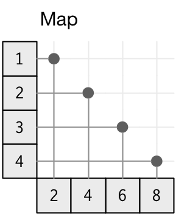
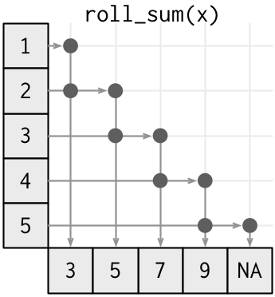
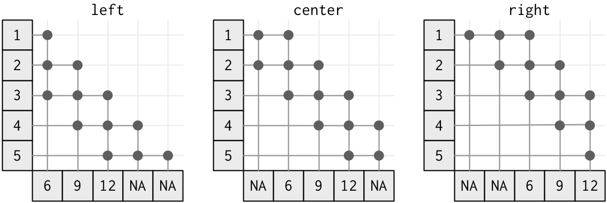
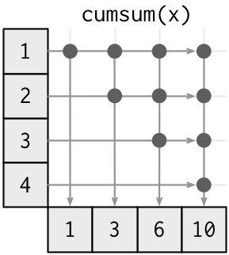
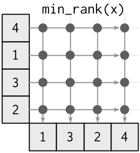

<!-- Generated automatically from window-functions-2.yml. Do not edit by hand -->

# Transformation functions <small class='wrangle'>[wrangle]</small>
<small>(Builds on: [Manipulation basics](manip-basics.md))</small>


`summarise()` and `mutate()` work at the data frame level: they take a data frame as input and return a data frame as output. You combine these data frame functions with with vector functions: functions that take a vector as input and return a vector as output. The length of the output determines whether a given function work with `summarise()` or `mutate()`:

-   `summarise()` works with **summary** functions; functions that take `n` inputs and return 1 output. This includes functions like `sum()` and `mean()` for numeric vectors; `all()` and `any()` for logical vectors; and `str_c()` with `collapse` for character vectors.

-   `mutate()` works with **transformation** functions: functions that take `n` inputs and return `n` outputs. So far you've mainly used vectorised maps, like `-` and `+`, or `&` and `|`. In this unit, you'll learn some finer details of these functions, and learn a new class of functions called **window functions**.

``` r
library(tidyverse)
```

Vectorised map functions
------------------------

### Unary

The simplest type of transformation function is the "unary vectorised map". This is a precise, but complicated name. Let's unpack it and explain each component:

-   **Unary** means that the function takes a single vector as input.

-   **Vectorised** means that the function takes a vector as input and returns a vector of the same length as the output (but possibly a different type).

-   **Map** is a mathematical term that means that you can independently compute each element of the output from the corresponding piece of the input. In other words, if your input is `x` and your output is `z`, the only value of `x` that `z[i]` depends on is `x[i]`.

The diagram below shows a vectorised function, focussing on how the input is connected to the output. The input is on the left, and the output is on the bottom. You can see how each input affects the output by following the lines right and down; you can see how an output is computed from the input by following the lines up and left. The connections for a vectorised function are simple: each input only affects the output at the same position.



It's helpful to organise unary vectorised maps by the type of input vector:

-   Numeric: most of these come from base R and include functions like `log()` and `abs()`, and operators like `!` and `-`.

    ``` r
    x1 <- c(1, 4, 2)
    -x1
    #> [1] -1 -4 -2

    x2 <- c(TRUE, FALSE, FALSE)
    !x2
    #> [1] FALSE  TRUE  TRUE
    ```

-   Character: these are provided by stringr and include functions like `str_length()`, `str_lower()` and `str_upper()`.

-   Date times: these are provided by lubridate and include functions like `yday()` and `year()`.

### Binary

Another extremely common class of transformation functions are the **binary** vectorised maps. These are similar to the unary transformation functions except that they take 2 vector inputs. You've used many of these functions already because they include the mathematical operators `-`, `+`, `/`, `*`, `%%` and `%/%`.

There is a new wrinkle with these functions: since they take two vectors, what happens if they are different lengths? For example, in `x * 2` below, `x` has length 5, but `y` has length 1.

``` r
x <- sample(100, 10)
y <- 2

x * y
#>  [1]  34  90 124 200 158 134 100   8 174  46
```

R has a special set of rules that cover this situation called the **recycling rules**. Whenever you call a binary vectorised fuction with inputs of different lengths, R will recycle the shorter vector to be the same length as the longer. This is particularly useful when combined with summary operators:

``` r
x - min(x)
#>  [1] 13 41 58 96 75 63 46  0 83 19
(x - mean(x)) / sd(x)
#>  [1] -1.152 -0.266  0.272  1.475  0.810  0.430 -0.108 -1.563  1.063 -0.962
```

(You can use recycling rules with vectors that are not of length 1, but that makes it easy to write confusing code, so I don't recommend it.)

Vectorised window functions
---------------------------

Vectorised map functions can be generalised to vectorised **window** functions. In a window function the output now depends on a contiguous window of values (i.e. a sequence with no gaps). Map functions are a special case of window functions because in a map function, the "window" is just a single value.

### Offset

The simplest type of window is an offset. Each output value still depends on only a single input value, but the input and output are no longer aligned. The following diagram illustrates offsets in either direction.


In dplyr you can use `lead()` (positive) and `lag()` (negative) to look at offsets.

``` r
tibble(
  x = 1:5,
  pos = lead(x),
  neg = lag(x)
)
#> # A tibble: 5 × 3
#>       x   pos   neg
#>   <int> <int> <int>
#> 1     1     2    NA
#> 2     2     3     1
#> 3     3     4     2
#> 4     4     5     3
#> 5     5    NA     4
```

Change the number of positions to look ahead or behind with the second argument, `n`.

Remember that these are vectorised functions, so the output must be the same length as the input. That means we need to pad either the beginning or the end of the vector. `lead()` and `lag()` pad with `NA` but you can change this value with the `default` argument.

`lead()` and `lag()` are very useful when combined with a binary vectorised map:

-   `x == lag(x)` tells you if `x` has changed compared to the previous value.

-   `x - lag(x)` tells you how `x` has changed.

### Rolling

Rolling window functions are the next step up in complexity. Instead of a window of size one, they now have a fixed window of size `m`.



Neither base R not dplyr provide rolling functions, but you can get them from the RcppRoll package. By default the `roll_` functions are not vectorised (they return shorter vectors), but you can make them vectorised by setting `fill = NA`.

``` r
library(RcppRoll)

tibble(
  x = 1:5,
  roll_sum = roll_sum(x, 2, fill = NA),
  roll_mean = roll_mean(x, 2, fill = NA)
)
#> # A tibble: 5 × 3
#>       x roll_sum roll_mean
#>   <int>    <dbl>     <dbl>
#> 1     1        3       1.5
#> 2     2        5       2.5
#> 3     3        7       3.5
#> 4     4        9       4.5
#> 5     5       NA        NA
```

You can control how the window is aligned to the data with the `align` argument. The following figure shows `n = 3` and the three possible values of `align`. Note that the output value is `NA` if there are less than 3 inputs.



### Cumulative

The next step up in complexity are the cumulative functions, where the window size is no longer constant. A cumulative function uses all values up to the current position.



Base R includes the cumulative functions `cumsum()`, `cumprod()`, `cummax()`, and `cummin()`. dplyr provides a few others: `cummean()`, `cumany()`, `cumall()`. I'm not aware of any useful cumulative functions for strings or date/times.

``` r
library(RcppRoll)

tibble(
  x = 1:5,
  cumsum = cumsum(x),
  cummean = cummean(x)
)
#> # A tibble: 5 × 3
#>       x cumsum cummean
#>   <int>  <int>   <dbl>
#> 1     1      1     1.0
#> 2     2      3     1.5
#> 3     3      6     2.0
#> 4     4     10     2.5
#> 5     5     15     3.0
```

### Complete

The most complex type of window function is the **complete** window function, where every output value depends on every input value.



This class of window function includes all the ranking functions, because the rank of any value depends on the rank of all the other values. There are three key ranking functions that differ in how ties are handled:

``` r
tibble(
  x = c(10, 10, 10, 20, 20, 30),
  min = min_rank(x),
  dense = dense_rank(x),
  row_number = row_number(x)
)
#> # A tibble: 6 × 4
#>       x   min dense row_number
#>   <dbl> <int> <int>      <int>
#> 1    10     1     1          1
#> 2    10     1     1          2
#> 3    10     1     1          3
#> 4    20     4     2          4
#> 5    20     4     2          5
#> 6    30     6     3          6
```

Use `desc()` if you want the highest inputs to have the lowest ranks.

`min_rank()` works like sports ranking: if there are three people tied for first place, the next rank is 4th place. `dense_rank()` ensures that the ranks are "dense", i.e. it doesn't skip any ranks for ties. `row_number()` breaks ties so that every row gets a unique number. It's easiest to understand the differences in terms of filtering:

-   `min_rank(x) <= 2` will select all elements in first place, and will only select another if there wasn't a tie for first.

-   `dense_rank(x) <= 2` will select all elements tied for first place, and all elements tied for the next rank.

-   `row_number(x) <= 2` will always select exactly two elements.

### Ordering

So far we've dodged the question of what we mean by "before" and "after", relying on the order of the rows. There are three ways to be more precise:

-   `arrange()` the data so you know exactly how the rows are ordered.

-   Use the `order_by` argument (if present), to order by a specific variable. This is more efficient than `arrange()` if you're only computing a single window function.

-   Use the `order_by()` helper if there is no `order_by` argument.
